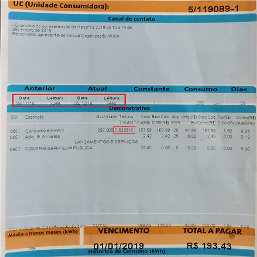

# Histórico de Consumo

### Resumo/Objetivos

Está aplicação tem como objeto fazer com que o usuario possa ter um histórico do seu consumo de energia e de quanto está gastando com esse serviço. Está aplicação é útil para que o usuário possa ter um controle financeiro melhor e que possa tomar decisões baseadas no seu histório mensal de gastos.

### Manual para uso da aplicação desenvolvida em QT com finalidade de criar um histórico de consumo de energia 

A tela inicial da aplicação (como mostra na figura abaixo) deve ser preenchida pelo usuário.

Esses dados podem ser encontrado em sua conta de energia. A figura abaixo, mostra os dados as serem preenchidos na aplicação:

Após preenchido todos os dados, o usuário deve precionar o botão "Inserir Dados", para que a tebela seja preenchida e consequentemente calcular o seu consumo (KWh) e o valor aproximado de sua conta de energia.

OBS.: No valor aproximado, já esta sendo somado os R$23,00 da contribuição de serviço de iluminação pública.

# Botões da página inicial da Aplicação

### Iserir Dados

Como já mencionado acima, o botão Inserir Dados após precionado, preenche a tabela com as informações do usuário.

### Ordenar por Valor

O botão "Ordenar por Valor" após precionado ordena a tabela de dados de forma decrescente. Ou seja, do maior valor aproximado para o menor.

### Ordenar por Consumo

O botão "Ordenar por Consumo" após precionado ordena a tabela de dados também de forma decrescente, porém levando em consideração o consumo. Ou seja, do maior Consumo para o menor.

Na figura abaixo temos um exemplo da função Ordenar por Consumo:

# Aba de Estatísticas

A aplicação também conta com uma aba para mostrar as estatísticas do turma.

Como pode ser visto na figura acima, a aba de estatisca conta com Média de Consumo (Calcula a média dos consumos em KWh preenchidos na tabela), Total de Consumo (Soma todos os consumos em KWh preenchidos na tabela) e Total Pago (Soma de todos os valores aproximados preenchidos na tabela).

# Exportar e Carregar

Esta aplicação também consta com as opções de Exportar e Carregar arquivos. A opção "Exportar" salva as informações que constam na tabela em um arquivo no formato txt e a opção "Carregar" importa as informações que estão em um arquivo salvo no seu Computador.

